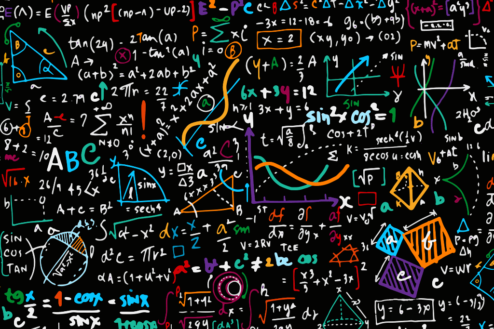

Effect of underline 
---

 

Colored text
---

**Definition 1:** A **probability space** is a measure space ($\Omega$, $E$, $P$) where $P(\Omega) = 1$ where 
1. The set $\Omega$, is called the **sample space**.
2. The $\sigma$-algebra over $\Omega$, denoted $E$, called the set of **events**.
3. The measure $P$ for the measureable space $(\Omega, E)$ is the **probability measure**.

 

Coloured equation 
---

$$\begin{equation} \mu : \mathcal{F} \rightarrow \mathbb{R} \end{equation} $$

$$ \mu : \mathcal{F} \rightarrow \mathbb{R} $$

$\mu : \mathcal{F} \rightarrow \mathbb{R}$

 

Cases in an equation
---

$$\text{Det}(\boldsymbol{A}) := \begin{cases} a_{1,1}a_{2,2} - a_{1,2}a_{2,1} & \text{if $m = 2$} \\ \sum_{i=1}^m (-1)^{i+1} a_{i,1} \text{Det}(\boldsymbol{A}_{-i, -1}) & \text{if $m > 2$}\end{cases}$$

 

Matrix
---

$$\boldsymbol{A} := \begin{bmatrix}a & b \\ c & d\end{bmatrix}$$

 

Adding an image
---
<figure>
<left>
  
  <figcaption style="text-align: left;">This is an image.</figcaption>
</left>
</figure>

 

Table formatting
---

<table>
  <tr>
    <th>Column 1</th>
    <th>Column 2</th>
  </tr>
  <tr>
    <td>Row 1 Cell 1</td>
    <td>Row 1 Cell 2</td>
  </tr>
  <tr>
    <td>Row 2 Cell 1</td>
    <td>Row 2 Cell 2</td>
  </tr>
</table>